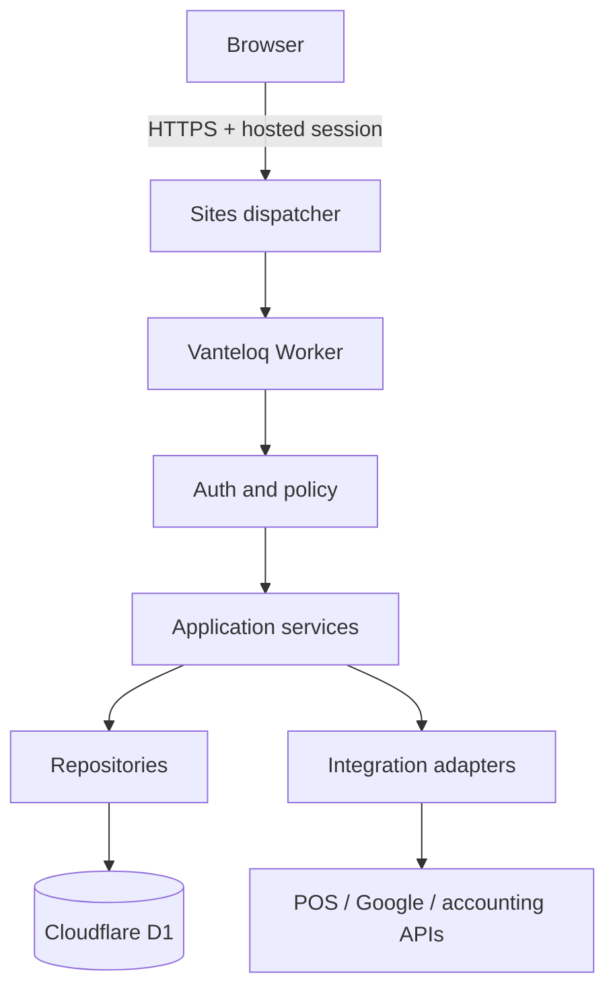
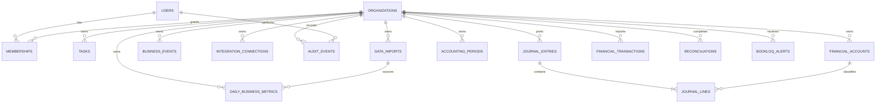

# Vanteloq target architecture

## Decision

Vanteloq will remain a modular monolith on a stateless Cloudflare Worker. D1 stores relational application data. The Sites dispatcher supplies initial authentication. Every protected request resolves organization scope from a server-side membership record. Client-provided organization IDs, roles, prices, permissions, or ownership values are never authoritative.

Independent public email/password, passkeys, and MFA require a supported production identity provider and are a separate gated phase. Until that provider is selected and configured, Vanteloq must use the real hosted sign-in flow and must not collect or pretend to register passwords.

## Component and trust-boundary view

Trust boundaries exist between the browser and dispatcher, dispatcher and Worker, Worker and D1, and Worker and each external provider. The browser is always untrusted. Provider callbacks remain untrusted until signature/state verification succeeds.

## Request layers

1. Route: method, content type, body size, origin, and authentication checks.
2. Schema: normalize and allowlist every accepted field.
3. Policy: resolve membership and authorize the operation.
4. Service: enforce workflow and idempotency rules.
5. Repository: issue prepared/ORM parameterized queries with organization scope.
6. Audit: record security-relevant outcome with redacted metadata.
7. Response: return a minimal DTO and safe structured error.

Business rules do not belong in client navigation or route handlers.

## Authentication flow

1. Anonymous visitor can view the public landing page.
2. Workspace creation or sign-in is sent to the dispatcher-owned sign-in path.
3. The dispatcher validates the session and forwards a trusted email header to the Worker.
4. The Worker normalizes the identity and finds an active membership.
5. A user without membership can create one first organization through the onboarding service.
6. Protected APIs fail with 401 when identity is absent, 403 when membership or permission is absent, and never fall back to a mock account.

## Authorization model

Initial roles:

- `owner`: full organization administration, integrations, exports, and member management
- `admin`: operations and membership management except ownership transfer
- `manager`: operational records, reports, imports, and team tasks
- `employee`: assigned operational work and limited business views
- `read_only`: permitted reports without mutation
- `integration`: non-human, scoped ingestion identity for a single adapter

The initial interface exposes owner behavior only, but the schema and policy vocabulary are forward-compatible. Deny-by-default rules apply to every action.

## Target data model

Phase-one tables:

- `users`: stable user identity and normalized email
- `organizations`: business and reporting profile
- `memberships`: organization role and state
- `workspace_tasks`: tenant-owned operational tasks with idempotency protection
- `data_imports`: tenant-owned, idempotent import history and status
- `daily_business_metrics`: date/location summaries used by the first reproducible intelligence engine
- `business_events`: decisions, promotions, stockouts, external events, expected outcomes, and review dates
- `integration_connections`: provider/status metadata only; no plaintext tokens
- `audit_events`: append-only security and business-control events
- `rate_limit_buckets`: bounded abuse-control counters

BookLoQ accounting tables:

- `bookloq_settings` and `bookloq_role_assignments`: tenant configuration and finance-role extension points
- `financial_accounts`: chart of accounts with account type, normal balance, explanation, tax treatment, and archive state
- `accounting_periods`: open/review/locked posting boundaries
- `journal_entries` and `journal_lines`: balanced double-entry source of truth, idempotent posting, and linked reversals
- `financial_transactions`: normalized bank, card, POS, processor, bill, invoice, payroll, loan, and owner activity feed
- `bank_accounts` and `reconciliations`: statement/book balances, preparation, review, supporting-status, and lock workflow
- `bookloq_contacts`, `supplier_bills`, and `customer_invoices`: shared parties and AP/AR records
- `bookloq_alerts`: traceable financial attention items with evidence, confidence, action, assignment, status, and resolution history
- `bookloq_budgets` and `month_end_items`: budget/actual/forecast controls and close dependencies

All stored money uses integer minor units. Percentage rates use basis points and exchange rates use parts per million. JavaScript floating-point values are never accepted or stored as monetary source values. Financial statements, sales-tax working values, ledger balances, reconciliation differences, and journal validation are deterministic server calculations. Explanatory assistance consumes those results but cannot create or replace them.

Posted entries are immutable in normal workflows. Corrections create a linked reversal in an open period; the original remains visible. Period unlock requires the owner-level finance permission, a reason, and an audit event. Future bank/POS/OCR/payment/filing adapters remain disabled until their provider-specific authorization, signature, idempotency, recovery, and reconciliation tests exist.

Later line-item model:

- `locations`, `data_sources`, `sync_runs`, `import_batches`, `import_errors`
- `products`, `product_variants`, `suppliers`, `inventory_snapshots`, `inventory_movements`
- `customers`, `transactions`, `transaction_lines`, `payments`, `discounts`, `returns`
- Derived metrics remain reproducible from normalized source facts and are never the only stored record.

The current daily-summary model calculates sales, product-cost gross profit, margin, transaction value, units per transaction, discounts, refunds, labour pressure, contribution after labour, aggregate balances, and 30-day comparisons. It cannot isolate SKU, customer, campaign, supplier, employee, channel, or hourly causes; those dimensions are explicitly returned as missing rather than inferred.

## Sensitive-data flow

- Identity headers terminate at the Worker and are not returned except as minimal account display data.
- Organization profile data is queried only after membership resolution.
- Future OAuth tokens belong in provider-managed encrypted secrets or envelope-encrypted storage; never browser storage or plaintext D1.
- Future CSVs use private object storage, short retention, staging validation, malware/type controls, and tenant-owned metadata.
- Analytics receives pseudonymous or aggregated events and must not receive tax numbers, provider tokens, customer contact details, or payment data.

## Failure and resilience model

- D1 unavailable: readiness fails and protected writes return a safe 503.
- Identity missing: fail 401 before database access.
- Membership missing: fail 403 or present onboarding, depending on route.
- Provider outage: preserve existing data, mark sync delayed, retry only idempotent jobs, and never block core app navigation.
- Duplicate client request: use organization-scoped idempotency keys and database uniqueness.
- Deployment: use backward-compatible migrations and immutable checkpoint deployments.

## Scaling approach

Worker instances remain stateless. D1, object storage, and future queues externalize state. Collection APIs use bounded pagination. Long imports, provider synchronization, exports, and report generation move to queues. Scaling triggers include p95 latency, D1 contention, queue age, import volume, and per-tenant dataset size.

## Backup and recovery baseline

The operator must configure and verify encrypted D1 backups, multiple restore points, restricted backup access, and a quarterly restoration exercise. Proposed initial objectives are RPO 24 hours and RTO 8 hours until business requirements justify tighter targets. These are targets, not evidence of configured backups.
