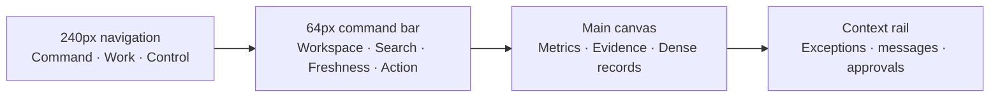

# Vanteloq Product UI Architecture

## Product stance

Vanteloq is an operating console for independent retail, not a collection of decorative dashboards. Every surface must answer one of four questions: what changed, why it matters, what needs approval, and what happened after the action.

## 1. Design system foundation

### Colour tokens

| Token | Hex | Exact use |
|---|---:|---|
| Canvas | `#F6F7F9` | Main application background |
| Surface | `#FFFFFF` | Cards, tables, drawers, inputs |
| Surface subtle | `#F9FAFB` | Table headers, toolbars, grouped controls |
| Sidebar | `#111827` | Persistent navigation |
| Sidebar selected | `#243247` | Active navigation row |
| Text primary | `#18212F` | Titles, metric values, table primary cells |
| Text secondary | `#475467` | Body copy and secondary table values |
| Text muted | `#667085` | Labels, timestamps, metadata |
| Border | `#DFE3E8` | Default 1px dividers and containers |
| Border strong | `#CBD2DA` | Inputs, sticky table headers, selected boundaries |
| Action | `#2563EB` | Primary actions, active links, selected data |
| Success | `#087F5B` | Verified, reconciled, healthy, sent |
| Warning | `#A15C07` | Held, stale, approval pending |
| Danger | `#B42318` | Failed, overdue, stockout, destructive action |
| Focus ring | `#60A5FA` | 2–3px keyboard focus indicator |

Colours are semantic, never ornamental. Charts use blue for the selected business series, neutral grey for comparison, green only for favourable verified change, amber for uncertainty, and red only for material risk.

### Typography

- UI and prose: Geist, falling back to Inter and system sans-serif.
- Financial values, SKUs, timestamps, quantities and identifiers: Geist Mono.
- Page title: 24px / 28px, weight 650, `-0.65px` tracking.
- Workspace title: 18px / 22px, weight 650.
- Card title: 13px / 18px, weight 650.
- Body: 11px / 17px for dense desktop UI; never below 10px for meaningful copy.
- Table body: 10–11px / 16px. Table labels: 9px uppercase with restrained tracking.
- Metric value: 20–24px tabular/monospace numerals.

### Geometry

- Default border: 1px neutral.
- Radius: 6px controls, 7–8px cards/panels, 9px modal. Pills only for statuses.
- Default shadow: `0 1px 2px rgba(16,24,40,.04)`.
- Elevated modal shadow only: `0 18px 48px rgba(16,24,40,.18)`.
- No gradients in application workspaces. No floating decoration. No card inside card unless the inner block represents a distinct record or decision.
- Desktop spacing unit: 4px. Common gaps: 8, 12, 16, 24px.
- Pointer targets: at least 24×24px; primary actions target 32–36px high.

## 2. Main layout

The Unified Workspace uses progressive density:

1. A single owner priority and its recommended action.
2. A compact metric strip for sales, profit, margin, basket and contribution.
3. A primary analytical panel beside a narrow owner-stress rail.
4. Ranked intelligence below, with evidence and confidence visible before action.

Finance, Inventory and Communications remain separate focused workspaces, but their exceptions are summarized in the Unified Workspace. This prevents the home screen becoming a wall of unrelated modules.

## 3. Core modules

### Finance / BookLoQ

- First row: actually available cash, bank balance, 30-day position, accounts payable and tax reserve. Never label bank balance as available cash.
- Metric cards always contain definition, period, freshness and comparison, not only a number.
- Trend chart: one selected series and one comparison maximum; direct labels and tooltips; no unnecessary legends.
- Cash forecast: step or line view with known obligations visually distinct from estimated inflows.
- Transaction centre: sticky headers, server filtering, confidence/reconciliation status, and a review drawer instead of inline form sprawl.

### Inventory

- Primary status: urgent stockouts, low stock, excess stock, dead stock and data gaps.
- Reorder Brain table columns: SKU, projected days, recommended quantity, case pack, lead time, cash impact, confidence, reason, approval state.
- Red indicates an actual stockout or failed constraint. Amber indicates at-risk or confidence gap.
- Quick actions live in the row or contextual drawer: review evidence, adjust recommendation, create PO, transfer stock.
- Supplier minimum, shelf life, storage and cash-floor failures are first-class constraint messages rather than hidden calculation details.

### Communications

- Communications is an operational queue, not a general email client.
- Messages are grouped by required action: held, failed, approval required, sent.
- Each record links to its originating payment, purchase order, invoice, customer or task.
- System event stream and stock follow-up appear in a separate context rail so the message list remains scannable.
- Incoming email integration must use thread identity, participant privacy permissions, attachment scanning and a provider-specific delivery status model before it is labelled live.

## 4. Dense tables

- Default row height: 42–44px; compact mode may use 36px when all targets retain safe spacing.
- Sticky column header at the command-bar offset.
- Primary identifier stays left; money and quantities align right and use tabular numerals.
- Hover changes the row background only. It does not move content.
- Reveal secondary row actions on hover/focus, but keep the primary row action keyboard reachable.
- Search, filters, sort and saved views live in one toolbar. Active filters become removable chips below it only when needed.
- Bulk actions appear after selection and state the selected count.
- Pagination is server-side and cursor-based for mutable event/transaction data. Virtualization is used after roughly 100 rendered rows or when row content is expensive.
- Inline editing is limited to low-risk fields. Financial, permission, inventory-adjustment and send actions open a review surface with reason and audit consequences.
- Empty states distinguish no records, no filter matches, missing connection, permission denied and delayed sync.

## 5. UX red flags

1. **Module explosion:** a long sidebar makes owners remember product architecture. Fix by grouping Command, Work and Control and using global search.
2. **Dashboard card soup:** equal-looking cards erase priority. Fix with one owner priority, one metric strip and a ranked queue.
3. **False real-time confidence:** live styling on stale or staged data destroys trust. Fix with source, freshness, reconciliation and promotion state.
4. **Hidden action consequences:** one-click sends, payments or inventory changes create risk. Fix with permission checks, preview, approval, reason and audit record.
5. **Tiny, low-contrast density:** density is not miniature typography. Fix with compact spacing, clear column alignment, 10–11px table text, 24px targets and visible focus.

## Research basis

- Shopify’s current index-table pattern combines scannable lists with search, filtering, sorting, selection, hover actions and pagination: https://shopify.dev/docs/api/app-home/patterns/compositions/index-table
- WCAG 2.2 defines visible focus and a 24×24 CSS pixel target-size minimum with stated exceptions: https://www.w3.org/TR/WCAG22/ and https://www.w3.org/WAI/WCAG22/Understanding/target-size-minimum
- Atlassian’s data-visualization guidance supports semantic, accessible chart colour rather than decorative palettes: https://atlassian.design/foundations/color-new/data-visualization-color
