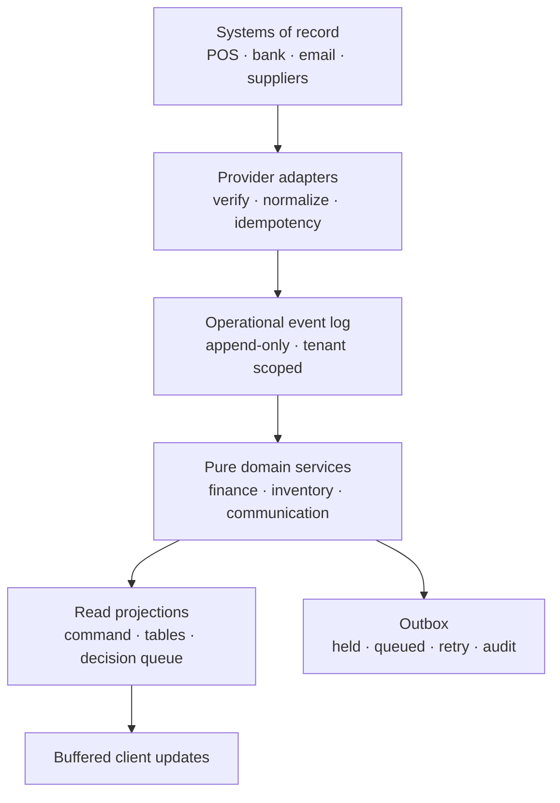

# Vanteloq Unified Event Architecture

## System model

## Contracts

The implemented `operational_events` record is the cross-module envelope:

- tenant: `organizationId`
- identity: `id`, `sourceSystem`, `sourceEventId`
- routing: `eventType`, `aggregateType`, `aggregateId`
- evidence: validated `payloadJson`
- ordering: `occurredAt`, `recordedAt`

Financial amounts are integer minor units. Inventory changes are append-only movements. Messages are an outbox with explicit delivery status. Provider replay cannot double-deduct inventory because each movement is unique to the normalized operational event.

## Implemented payment settlement flow

1. Validate strict content type, same origin, role, rate limit and typed payment schema.
2. Recalculate line totals and reject mismatches.
3. Create a deterministic tenant/source event key.
4. Persist `payment.settled` with `INSERT OR IGNORE`.
5. Persist one unique negative inventory movement per payment line.
6. Prepare a customer confirmation in `held` state when an email exists.
7. Append a security audit event.
8. The Communications workspace fetches cursor-based changes and commits one buffered React transition per response.

The email is deliberately held until a verified provider exists. This prevents the UI from claiming dispatch while preserving complete work for later retry.

## Frontend state

- Server state: authoritative D1 projections exposed by no-store APIs.
- View state: local React state for filters, selected rows, open drawers and navigation.
- High-frequency updates: cursor fetch, bounded event buffer, one `startTransition` commit per batch.
- Search: `useDeferredValue` keeps dense filtering responsive.
- Mutations: idempotency keys and server reconciliation; optimistic rendering is allowed only for reversible, low-risk UI changes.
- Future scale: hydrate command-centre data on the server to remove waterfalls; use TanStack Query selectors for larger client surfaces; move fan-out work to Cloudflare Queues and multi-step workflows to Cloudflare Workflows.

## Caching and performance

- Never cache identity-, permission- or cash-sensitive API responses in a shared cache.
- Cache immutable reference data and expensive non-sensitive aggregates with scoped tags.
- Use cursor pagination for operational events and transactions; offset pagination only for stable administrative lists.
- Virtualize long tables and preserve semantic table alternatives for accessibility.
- Keep connector webhooks off the request critical path after signature verification and durable acceptance.
- Use a tenant or connection partition key for ordered processing where provider order matters.

## Failure model

- Duplicate event: acknowledge as replayed; no repeated movement or message.
- Missing source: do not infer; mark the projection limited.
- Email provider unavailable: keep message held.
- Delivery failure: exponential retry with capped attempts, stable error code and manual recovery.
- Client offline: keep last verified snapshot visibly stale; resume from cursor.
- Permission removed: server rejects on every request; client cache is cleared for affected scopes.
- Projection disagreement: quarantine source promotion and create a reconciliation exception.

## Current official engineering basis

- TanStack Query documents tracked render optimization, unique query keys, SSR hydration and avoidance of client request waterfalls: https://tanstack.com/query/latest/docs/framework/react/guides/queries and https://tanstack.com/query/latest/docs/framework/react/guides/request-waterfalls
- Next.js 16 documents streaming fresh data and explicit component/function caching: https://nextjs.org/docs/app/getting-started/fetching-data and https://nextjs.org/docs/app/getting-started/caching
- Cloudflare recommends Queues for decoupling, fan-out and buffered batches, and Workflows for durable multi-step execution: https://developers.cloudflare.com/workers/best-practices/workers-best-practices/
- Durable Objects provide strongly consistent coordination for stateful real-time systems: https://developers.cloudflare.com/durable-objects/
