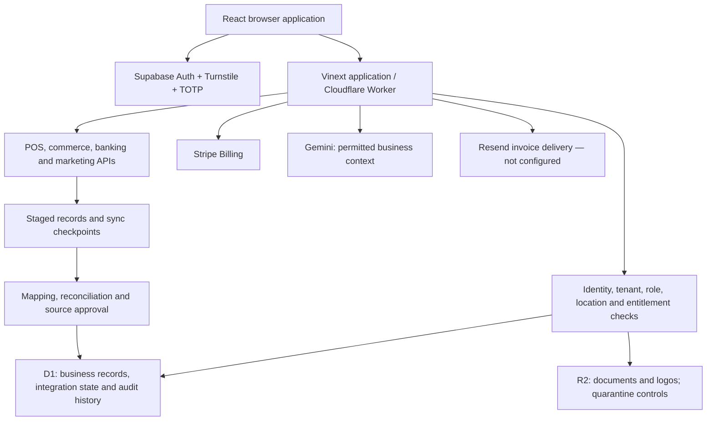

# Vanteloq project and connection audit — 10 September 2026

This is a point-in-time review of the deployed source, Sites configuration, selected production logs and connection records, and isolated automated tests. It supersedes older capability summaries where they contradict current code. A saved credential or a “connected” row is not proof that a provider works end to end today.

## What the product is

Vanteloq is an operating workspace for independent retailers. It brings source records into commerce reporting, inventory, purchasing, operations, marketing and BookLoQ financial workflows. Source selection, consent, reconciliation and approval control which records may influence reporting.

The public website and resource library lead into email verification, authenticator setup, business onboarding and subscription selection. The signed-in application uses roles, location access and paid entitlements to decide what each member can see and do.

BookLoQ is a separate accounting domain inside the same application: accounts, journals, customer invoices, payables/receivables, bank evidence and cash analysis. Connecting a bank does not authorize money movement, and importing provider records does not automatically approve them as accounting truth.

## Technical map

- Runtime: React 19, Vinext 0.0.50 and Vite 8.0.13, packaged as a Cloudflare Worker. Next 16.3.0 is installed for compatibility; this deployment is not a conventional Next Node server.
- D1 is the operational database. The optional Supabase business-data backend is switched off; Supabase Auth remains active.
- Supabase uses password authentication, PKCE email callbacks, persisted rotating sessions and TOTP. Server-side authorization requires the proper assurance level.
- R2 stores documents. Quarantine and clean-file checks restrict downstream use. Trusted malware scanning remains an unfinished dependency; do not relabel files as clean to make a workflow pass.
- Sites owns source history, deployment, runtime settings and the public domain. The active source was retrieved from Sites onto this Lenovo. That confirms the project revision used for this work; it does not certify every unrelated file in the Mac transfer.
- Main domains: vanteloq.com and connectors.vanteloq.com. The primary custom domain and certificate are active.

Useful code entry points: app/auth-panel.tsx, app/supabase-browser.ts, app/api/v1/auth/signin/route.ts, server/api.ts, server/permissions.ts, db/schema.ts, the integration route folders, and the provider modules under server/.

## Sign-in and recovery findings

1. **Security verification could leave forms stuck.** A failed Turnstile script promise was reused on later attempts. The repair clears failed loads, bounds loading time, ignores callbacks from removed widgets and adds an explicit retry control for failures and expiration.
2. **Sign-in errors were misleading.** CAPTCHA failures and upstream service/configuration errors were reported as incorrect credentials. The repair separates these outcomes and keeps provider diagnostics private.
3. **Sign-in changed certain passwords.** NFC normalization could alter a decomposed Unicode password after signup or recovery had stored the original characters. Passwords are now forwarded exactly as entered, including legitimate spaces.
4. **Recovery did not provide an easy entry for an existing email code.** A visible “I already have a recovery email code” path now opens code verification without sending another email. Invalid-link guidance explains the same-browser requirement and code alternative.
5. **Recovery send failures could leave busy state active.** The request now consistently releases busy state and refreshes the CAPTCHA after success, provider rejection or a thrown request failure.
6. MFA, same-origin checks, request limits and CAPTCHA enforcement remain required.

Production evidence showed a reset dispatch timestamp at 18:51:12 UTC on 10 September, followed by a recovery callback. This proves the backend recorded a request; it does not prove inbox delivery or a completed password change. The recorded latest successful sign-in was still on 8 September when inspected.

The in-app browser showed a Turnstile failure during this audit. Final recovery must be completed by the account owner in a supported browser with the newest email and their authenticator. No password was requested, read or changed by the agent.

Supabase documents that PKCE exchange requires the browser/device holding the original verifier. A computer or browser switch can therefore explain a failed email-link exchange, but the observed logs alone do not establish that as the only cause. See [PKCE flow](https://supabase.com/docs/guides/auth/sessions/pkce-flow), [Auth error codes](https://supabase.com/docs/guides/auth/debugging/error-codes), and [Turnstile error handling](https://developers.cloudflare.com/turnstile/troubleshooting/client-side-errors/).

## Connections and readiness

The connection inventory contained 14 rows, including pending and revoked records. Dates below are the stored latest successful sync dates, not new live-provider test results.

| Service | Observed state | What remains |
| --- | --- | --- |
| Sites / Cloudflare / D1 / R2 | Active deployment, public routes reachable, bindings present | Continued operational monitoring; file scanning completion |
| Supabase Auth | Active healthy project; email confirmed for the tested account | Owner completes recovery, MFA and a new successful sign-in |
| Plaid | Credentials present; environment was missing; one staged connection last synced 16 Aug | Sandbox was explicitly confirmed by the owner and saved as PLAID_ENV=sandbox. Deployment must apply the setting; then validate Link and a fresh sandbox sync. This is not production bank readiness |
| Lightspeed R-Series | One approved connected record; last sync 13 Aug | Fresh authorization/refresh and merchant reconciliation |
| Lightspeed X-Series | Revoked record in the inventory | Reconnect if needed; mapping, reconciliation and promotion remain incomplete in the release notes |
| Square | One approved connection; last sync 15 Aug; SQUARE_PRODUCT_COST_UNAVAILABLE recorded | Refresh and reconcile seller totals; supply/verify product costs before trusting margin |
| Clover | One staged connection; last sync 14 Aug; another revoked | Fresh sync, location mapping and source approval |
| Moneris | Approved connection; last sync 15 Aug | Fresh report import and reconciliation |
| Google services | Five pending blocked records and one connected staged record; no successful sync on the connected row | Resource selection and a fresh import. Public OAuth verification, Business Profile quota/policy and Ads access are separate requirements |
| Shopify / Shopify POS | Configuration and route implementations present; no connection in this inventory | Real shop OAuth, locations, import and reconciliation |
| Stripe Connect | Configuration and routes present; no connection in this inventory | Real-account authorization and staged reporting validation |
| Stripe Billing | Separate billing configuration and webhook path present | Isolated live checkout/portal/cancellation acceptance was not performed; no charge was made |
| QuickBooks | Sandbox configuration; no connection in this inventory | Current adapter verifies company access; full ledger import/reconciliation and production readiness remain unfinished |
| Meta | Required app ID/secret not configured | Developer app setup/review and remaining organic insights implementation |
| Gemini | Configured, code and permitted-context paths present | Real authenticated advisor acceptance; no proof of every query outcome |
| AddressComplete | Configuration present | Authenticated address-lookup acceptance remains |
| Invoice email / Resend | API key and sender settings not configured | Verified sender and delivery/bounce/retry acceptance. This is separate from Supabase password-reset mail |
| Xero, payroll, delivery providers, local opportunity data | Current release notes identify incomplete or future capabilities | Provider choice, access and engineering; do not present as active integrations |

Clover's callback on connectors.vanteloq.com correctly rejected a request lacking OAuth browser state with HTTP 400. Square's POST webhook there correctly rejected an unsigned payload with HTTP 401. Matching primary-domain paths behaved the same. These are valid security rejections, not broken callbacks. Provider consoles and valid signed live callbacks were not independently exercised.

Old sync dates do not by themselves mean expired credentials. However, they are insufficient evidence for a “live” freshness claim. The prior remediation notes also identify durable scheduling, queues, retries and replay as unfinished; browser refresh is not a substitute for background ingestion.

## Other errors and incomplete paths

- **Dependency audit fails.** The current production dependency audit reported known advisories affecting Next, Sharp, MapLibre GL and baseline-browser-mapping. The two-day-old “zero vulnerabilities” statement is no longer current. Dependencies were not changed as part of the auth repair.
- Next's Windows server and image-processing advisories need assessment against the actual Vinext Worker deployment and the local development server. Installed code alone does not prove that the vulnerable Next server path is reachable.
- MapLibre's attribution sanitizer advisory matters when maps use externally supplied style/attribution data. The live map-style setting was absent during this inspection. Keep the map disabled until the library is patched and tested.
- Invoice email cannot complete with the missing sender configuration. Document quarantine also intentionally blocks unverified uploads from downstream use.
- Google Business Profile content-storage restrictions, Square refunds/time-zone/location completeness, QuickBooks ledger import, report PDF/XLSX delivery and normal customer invitations remain in the prior release's unfinished-work list.
- Several npm scripts assume Bash, POSIX environment assignment and /tmp. Direct Node equivalents successfully built and tested this checkout on Windows, but a complete conversion of the standard developer commands remains needed.
- Large client-bundle warnings remain. No new page-load performance benchmark was performed.
- Account deletion, paid checkout, cancellation, merchant reconnects and financial source promotion were not executed against production. These need disposable or deliberately authorized test accounts and records.

Primary advisory references: [MapLibre](https://github.com/advisories/GHSA-jrc7-96c5-q579), [Next Windows](https://github.com/advisories/GHSA-p293-qw3h-jr36), [Next image handling](https://github.com/advisories/GHSA-2xp9-vwfh-vxw4), [Sharp](https://github.com/advisories/GHSA-rgj7-g3m4-5g8c), [baseline-browser-mapping](https://github.com/advisories/GHSA-w5vr-8v7q-w6rv).

## Verification completed

| Check | Result | Scope |
| --- | --- | --- |
| Production build | Passed | Worker and browser assets generated |
| TypeScript | Passed | Full project typecheck |
| ESLint | Passed | Changed auth and regression-test files |
| Auth/recovery/loader tests | 19 passed | Email templates, recovery MFA, code verification, safe errors and script retries |
| Security / interactions / sign-in flow | 95 passed | Includes exact password forwarding, provider failures, CAPTCHA, origin and rate-limit boundaries |
| Provider/domain/reporting tests | 188 passed | 24 selected suites; isolated data and mocked services |
| Built-worker integration flows | 11 passed | Identity recovery, Google resource selection, Square import and intelligence |
| Live route audit | 33 of 33 expected responses | 23 public/config/health GETs returned 200; 10 protected GETs returned expected 401 |
| Recovery UI | Passed for navigation | Existing-code entry is reachable; empty-code submit stays disabled |
| Production dependency audit | Failed | Outstanding advisories above |

The 313 automated test results are from the selected runs, not a claim that the entire standard check command ran. A Windows path-separator issue in the interaction test was corrected. Provider mocks validate application behavior, not current third-party permissions, service approvals or real merchant totals.

## Recommended order after the auth repair

1. Complete the owner's recovery in a normal supported browser and confirm an authenticated AAL2 session.
2. Patch and validate the dependency advisories before enabling optional map features or broadening release access.
3. Validate Plaid sandbox Link and refresh, then refresh the approved POS connections with source reconciliation.
4. Configure transactional invoice email and trusted document scanning before advertising those paths as complete.
5. Finish durable sync processing and provider-specific acceptance; keep incomplete services clearly marked.
6. Update stale top-level documentation and make the usual developer commands portable to Windows.

Deployment outcome and any subsequent live verification are recorded in the companion audit delivered with this task. No live charge, bank transfer, payroll action, campaign change, customer deletion or historical financial rewrite was performed.
